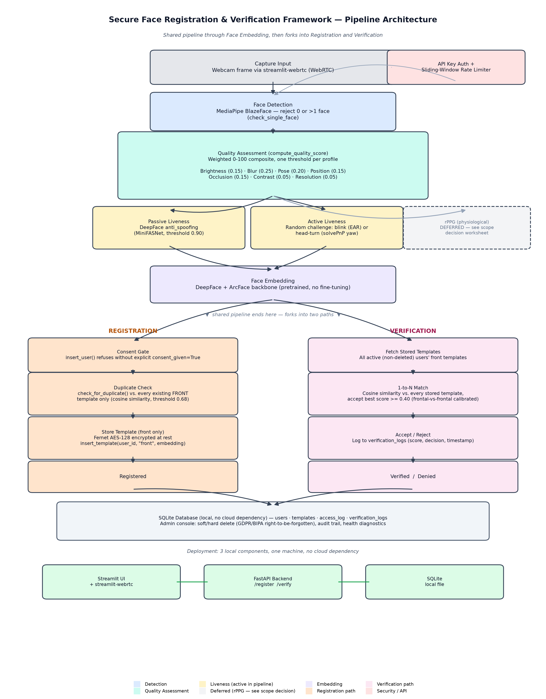

# Secure Face Registration and Verification Framework ("Nishika")

This repository implements a production-ready, highly modular face registration and verification pipeline with integrated quality assessment, active/passive liveness detection, AES-128 encryption-at-rest, and GDPR/BIPA compliance features.

---

## 📊 Results

Every number below is measured against real data (calibration images, real live camera sessions, or real profiling runs) and traceable to the script or report that produced it — not estimated. Full detail and methodology: [`data/Evaluation_Report.md`](data/Evaluation_Report.md) and [`docs/final_confirmation_report.md`](docs/final_confirmation_report.md).

### Security Results

**Deployed threshold: 0.38** — swept across candidate values against 595 real impostor pairs + 106 genuine pairs (CFP + self-collected, frontal-vs-frontal, the deployed verification path); gives the identical false-accept rate as the previous 0.40 default while rejecting one fewer genuine user in 106.
- **FAR: 0.34%** (2/595) — false acceptance rate
- **FRR: 14.15%** (15/106) — false rejection rate
- **EER: 3.19%** at threshold 0.2642 — deliberately *not* deployed, since its FAR is too high for a security-critical use case. The evaluation report documents this trade-off explicitly rather than defaulting to the statistically "optimal" point.

**Live physical attack testing — verified against the actual running app, not simulated.** Two different real presentation attacks, `DEBUG_CHALLENGE=1` logging capturing every decision in real time:

| Attack | Attempts | Per-attempt fail ratio (trained model) |
|---|---|---|
| Video replay (playback on a second screen) | 2/2 caught | 11/11, then 5/5 |
| Physical photo (hand-held, moved to defeat static-frame detection) | 3/3 caught | 3/5, then 3/3, then 3/3 |

The lightweight frame-repetition heuristic contributed **zero** catches across all 5 attempts combined — the trained anti-spoof model did all of the real detection work, verified empirically rather than assumed. A genuine live user was unaffected in the same session immediately after a flagged attempt (0/6 false-flagged samples) — a caught attack doesn't lock out the real person.

### Bugs Found Through Actual Testing

- **Compliance-critical bug**: GDPR hard-delete silently failed via a foreign-key violation for any user who had ever completed a verification — invisible until the delete path was actually tested end-to-end (the prior test suite never logged a verification before calling delete).
- **Config bug**: the health-check endpoint hardcoded its own database path independently of the app's `FACE_DB_PATH` override, so a relocated database would silently be checked at the wrong location.
- **Security regression**: a critical active-liveness bypass was found and fixed same-day by testing the fix itself against a live user, not just shipping it and assuming it worked.

### Fairness Audit — Including a Self-Correction

The project's original demographic bias study was found to be built on auto-generated placeholder labels that had never been hand-corrected, despite being presented as real findings for months. This was caught, 100 identities (200 photos) were manually re-annotated by hand, and the corrected results **reversed the direction** of the original gender-bias finding.

One identified root cause — skin-tone brightness bias, where whole-image mean brightness conflates "the room is dark" with "this person's skin is dark" — was traced and fixed: switched the metric to 90th-percentile highlight brightness (present on a face under adequate light regardless of skin tone). Verified with a true apples-to-apples comparison (old metric vs. new metric, same 100-identity/200-photo sample, not two different sample sizes):
- Skin-tone brightness gap: **18.7 → 10.4 percentage points** (a 44% relative reduction), confirmed by re-computing the old metric against the exact same larger sample rather than comparing across sample sizes
- Composite quality pass rate: **88.0%** overall, with **zero subgroups regressing** as a result of the fix
- A second, smaller gender gap (contrast) was investigated the same way and found to have no established physical cause and too small a sample to fix responsibly — left disclosed rather than tuned to one dataset

### Production Readiness & Performance

- Docker image: **13.2GB → 6.7GB** (49% reduction), from routing the CPU-only deployment away from a default CUDA-bundled PyTorch wheel — verified by building both versions and comparing real `docker images` output.
- Real profiled resource cost: ~28s one-time model warmup, ~1.2GB RAM once warm (not estimated).
- Per-tick latency breakdown: 44–166ms of actual compute vs. 1.1–1.9s real wall-clock time per tick — the gap is documented as an honest architectural limitation of the rPPG (remote photoplethysmography) liveness layer, not glossed over.
- CI publishes a new image to GHCR on every verified push to `main`, gated behind a real *runtime* smoke test (the container is started and its health endpoints polled) — not just a successful `docker build`.
- 86 automated tests, ~73% coverage across the core pipeline and the FastAPI layer.
- WCAG contrast audit found 2 real accessibility failures invisible to casual visual inspection (4.41:1 and 3.58:1 contrast ratios, both below the 4.5:1 WCAG AA minimum) — both fixed and re-verified with a regression test that was confirmed to actually catch the original bug before being trusted.

---

## 🏗️ Project Architecture

```
.
├── .gitignore
├── requirements.txt
├── setup_folders.py             # Script to establish project directory layout
├── sanity_check.py              # Verification script for environment dependencies
├── run_app.py                   # Unified application launcher (FastAPI + Streamlit)
├── capture_images.py            # Webcam capture tool with integrated face detector
├── download_datasets.py         # Downloads CFP and CelebA-Spoof development datasets
├── src/
│   ├── __init__.py
│   ├── keys.py                  # Git-ignored secure key loading and auto-generation helper
│   ├── quality_checks.py        # Real-time brightness and blur quality checks
│   ├── quality_checks_day8_9.py # Real-time face detection, pose and occlusion checks
│   ├── quality_score.py         # Multi-profile weighted composite quality score calculator
│   ├── liveness_passive.py      # Passive spoofing analysis using MiniFASNet
│   ├── liveness_active.py       # Active liveness blink/yaw challenges
│   ├── rppg.py                  # Remote photoplethysmography heart-rate checking
│   ├── face_matching.py         # Cosine-similarity ArcFace matching engine
│   ├── duplicate_check.py       # 1-to-N registration duplicate check blocker
│   ├── encryption.py            # AES-128 Fernet database encryption helper
│   ├── pipeline.py              # Central coordinator pipeline (Verify, Quality, Liveness)
│   └── db.py                    # Face enrollment database interface with BIPA logging
├── api/
│   ├── __init__.py
│   ├── security.py              # API rate limiting and X-API-Key auth middleware
│   ├── health.py                # System health check endpoints
│   └── api.py                   # FastAPI endpoints (register, verify, delete, logs)
├── app/
│   ├── streamlit_app.py         # Streamlit automated-capture dashboard
│   └── styles.py                # Elegant custom styling tokens and variables
├── tests/                       # 86 tests, ~73% coverage across src/ + api/ -- see Results above
│   ├── conftest.py              # Pytest fixtures (temp isolated DB, real/synthetic image fixtures)
│   ├── test_database_and_security.py
│   ├── test_matching.py
│   ├── test_quality_and_liveness.py
│   ├── test_pipeline.py         # Full quality -> liveness -> matching orchestration
│   ├── test_active_liveness_gate.py
│   ├── test_liveness_active.py  # Replay-loop detector, blink/head-turn tick evaluators
│   ├── test_duplicate_check.py
│   ├── test_rppg.py
│   ├── test_api_security.py     # API-key auth + rate limiter
│   ├── test_api_health.py
│   ├── test_api_endpoints.py    # Full register -> verify -> delete lifecycle via TestClient
│   ├── test_polling_rerun_fallback.py
│   └── playwright/              # Cross-browser UI contrast + accessibility regression suite
├── docs/
│   ├── Evaluation_Report.md     # Full calibration methodology, ROC curves, bias study, all corrections
│   ├── final_confirmation_report.md
│   ├── deployment.md
│   ├── system_requirements.md
│   └── Final_Report_Full.docx   # Full project narrative and phase-by-phase history
└── data/
    ├── cfp_demographics.csv     # 100 real, hand-annotated identities (skin tone/gender/age)
    └── self_collected/          # User self-collected dataset
```

---

## 🧭 Pipeline Architecture Diagram

Box-and-arrow diagram of the actual running pipeline: Capture → Face Detection → Quality Assessment → Liveness (Passive + Active) → Face Embedding → Matching → Accept/Reject, the parallel Registration path, and where encryption, consent, rate-limiting, and duplicate-check sit in the flow.



Source/editable version: [docs/architecture_diagram.svg](docs/architecture_diagram.svg). Generated by `scratch/build_architecture_diagram.py`.

---

## 🔒 Security & Key Management

This project enforces strict security practices. Hardcoded keys or credentials are never stored in source code. 

Environment variables are initialized via a `.env` file (which is git-ignored):
- **`FACE_DB_ENCRYPTION_KEY`**: A base64 32-byte Fernet key used to encrypt biometric template embeddings at rest in the SQLite database.
- **`FACE_API_KEY`**: A unique token checked in the `X-API-Key` HTTP header of all API calls.

When starting the application using `python run_app.py`, the system automatically checks for a `.env` file. If any key is missing, it **automatically generates secure, random keys**, appends them to `.env`, and outputs them to the console.

---

## 🚀 Setup & Running

### 1. Create Virtual Environment and Install Libraries
Ensure you are using **Python 3.10** or **3.11**:
```bash
# Create virtual environment
py -3.11 -m venv venv

# Activate virtual environment
.\venv\Scripts\Activate.ps1

# Install requirements
pip install -r requirements.txt
```

### 2. Establish Folders and Run Sanity Check
```bash
# Initialize folders
python setup_folders.py

# Verify environment imports, webcam accessibility, and model initialization
python sanity_check.py
```

### 3. Run the Unified Application
To run both the **FastAPI secure backend** (port `8000`) and the **Streamlit frontend dashboard** (port `8501`) concurrently:
```bash
python run_app.py
```
Open your browser at `http://127.0.0.1:8501`.

---

## 🧪 Testing Suite
Verify that all database transaction logic, liveness checks, and matching algorithms function correctly by running the pytest suite:
```bash
.\venv\Scripts\python.exe -m pytest tests/ -v
```

---

## ⚙️ Core Operational Flow

1. **Guided Onboarding**: Toggle to **Guided Enrollment**. The dashboard will prompt you to type your name, check the BIPA consent form, and align your face. Automated capture tracks pose and quality using an OpenCV pixel-burned outline, and triggers a 1.5-second countdown to snapshot a single front-facing template automatically. Enrollment is deliberately single-angle: `duplicate_check.py` already only ever compares front templates, and best-of-three matching for a frontal live query resolves via the front template almost every time (frontal-frontal EER 3.19% vs. cross-angle EER 27.06%, see `data/Evaluation_Report.md` Sections 3-4), so a left/right capture step was not meaningfully contributing to verification accuracy (see `docs/scope_decision_worksheet.md`).
2. **Identity Verification**: Toggle to **Verify Identity**. Align your face straight ahead. Once the automated capture acquires the frame, the system checks:
   - **Quality Score**: Assesses blur, lighting, centering, and pose according to compliance settings.
   - **Liveness detection**: Runs passive MiniFASNet spoof verification.
   - **Matching**: Extracts ArcFace embeddings and performs a 1-to-N database lookup at our calibrated threshold of `0.38` (frontal-vs-frontal EER-informed, see the Results section above and `data/Evaluation_Report.md`).
3. **GDPR Right to be Forgotten**: Admins can use the **System Management & Audits** console at the bottom of the dashboard to soft-delete or permanently hard-delete user templates from the database.
